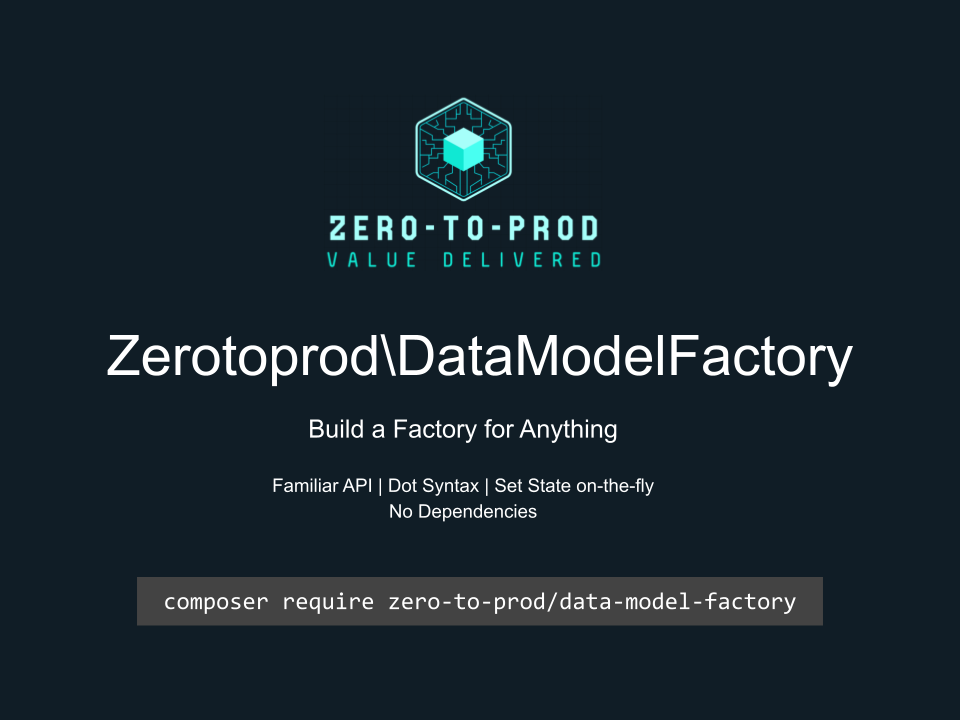

# Zerotoprod\DataModelFactory



[](https://github.com/zero-to-prod/data-model-factory)
[](https://github.com/zero-to-prod/data-model-factory/actions)
[](https://packagist.org/packages/zero-to-prod/data-model-factory/stats)
[](https://packagist.org/packages/zero-to-prod/data-model-factory/stats)
[](https://packagist.org/packages/zero-to-prod/data-model-factory)
[](https://github.com/zero-to-prod/data-model-factory/blob/main/LICENSE.md)

## Introduction

This package is a fresh take on how to set the state of your DTOs in a simple and delightful way.

The API is takes some hints from Laravel's Eloquent [Factories](https://laravel.com/docs/11.x/eloquent-factories), but adds some niceties such as
setting state via dot syntax and using the [set()](#using-the-set-method) helper method on the fly.

This package does not require any other dependencies, allowing you to make a factory for anything.

The examples use the [DataModel](https://github.com/zero-to-prod/data-model) trait, making easier to build your DTOs, but it is not required.

## Installation

Install the package via Composer:

```bash
composer require zero-to-prod/data-model-factory
```

### Additional Packages

- [DataModel](https://github.com/zero-to-prod/data-model): Transform data into a class.
- [DataModelHelper](https://github.com/zero-to-prod/data-model-helper): Helpers for a `DataModel`.
- [Transformable](https://github.com/zero-to-prod/transformable): Transform a `DataModel` into different types.

## Usage

This example makes use of the [DataModel](https://github.com/zero-to-prod/data-model) trait to instantiate the `User` class.

You can install the DataModel package like this:

```bash
composer require zero-to-prod/data-model
```

If you don't want to use this trait, you can [customize the class instantiation](#custom-class-instantiation) this way.

1. Include the Factory trait in your factory class.
2. Set the `$model` property to the class you want to instantiate.
3. Implement a `definition()` method that returns an array of default values.

4. NOTE: The `$this->state()` method accepts dot syntax, arrays, or a callback.

```php
class User
{
    use \Zerotoprod\DataModelFactory\DataModel;

    public $first_name;
    public $last_name;
    public $address;
    
    public static function factory(array $context = []): UserFactory
    {
        return new UserFactory($context);
    }
}

class UserFactory
{
    use \Zerotoprod\DataModelFactory\Factory;

    /* This is the class to be instantiated with the make() method */
    protected $model = User::class;

    protected function definition(): array
    {
        return [
            'first_name' => 'John',
            'last_name' => 'N/A',
            'address' => [
                'street' => 'Memory Lane'
            ]
        ];
    }
    
    public function setStreet(string $value): self
    {
        /** Dot Syntax */
        return $this->state('address.street', $value);
    }
    
    public function setFirstName(string $value): self
    {
        /** Array Syntax */
        return $this->state(['first_name' => $value]);
    }
    
    public function setLastName(): self
    {
        /** Closure Syntax */
        return $this->state(function ($context) {
            return ['first_name' => $context['last_name']];
        });
    }
    
    /* Optionally implement for better static analysis */
    public function make(): User
    {
        return $this->instantiate();
    }
}

$User = UserFactory::factory([User::last_name => 'Doe'])
            ->setFirstName('Jane')
            ->make();
            
User::factory([User::last_name => 'Doe'])->make(); // Also works for this example

echo $User->first_name; // 'Jane'
echo $User->last_name;  // 'Doe'
```

## Using the `set()` Method

You can use the `set()` helper method to fluently modify the state of your model in a convenient way.

This is a great way to modify a model without having to implement a method in the factory.

```php
$User = User::factory()
            ->set('first_name', 'John')
            ->set(['last_name' => 'Doe'])
            ->set(function ($context) {
                return ['surname' => $context['last_name']];
            })
            ->set('address.postal_code', '46789') // dot syntax for nested values 
            ->make();

echo $User->first_name;             // John
echo $User->last_name;              // Doe
echo $User->surname;                // Doe
echo $User->address->postal_code;   // 46789
```

## Custom Class Instantiation

To customize instantiation, override the `make()` method.

```php
class User
{
    public function __construct(public string $fist_name, public string $last_name)
    {
    }
}

class UserFactory
{
    use \Zerotoprod\DataModelFactory\Factory;

    private function definition(): array
    {
        return [
            'first_name' => 'John',
            'last_name' => 'Doe',
        ];
    }

    private function make(): User
    {
        return new User($this->context['first_name'], $this->context['last_name']);
    }
}

$User = UserFactory::factory()->make();

echo $User->first_name; // 'Jane'
echo $User->last_name;  // 'Doe'
```